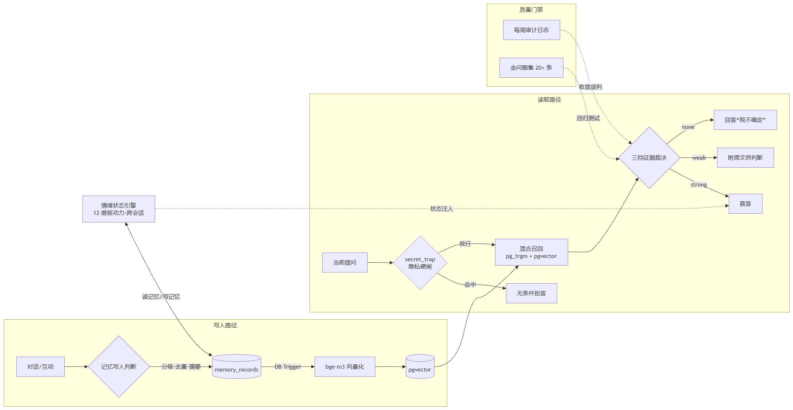

# AI Companion Memory System

> 一套让 AI「记得住、想得起、不敢瞎编、还有连续情绪」的长期记忆系统。

## 这是什么

大模型天然没有长期记忆——每次对话都从零开始。对工具类产品这不致命，但对**陪伴类 AI 产品**来说，记不住 = 关系不成立。

这套系统是我为解决这个核心痛点，从零独立设计并落地运行的。它不是 demo，而是在真实场景中持续运行、累计沉淀 **430+ 条记忆**的完整系统。

## 核心模块

| 模块 | 解决的问题 | 文档 |
|---|---|---|
| 记忆写入 + RAG 混合召回 | 「记不住 / 想不起」 | [01-记忆系统架构.md](docs/01-记忆系统架构.md) |
| 情绪状态引擎 | 「情绪是假的 / 没有连续性」 | [02-情绪状态引擎.md](docs/02-情绪状态引擎.md) |
| 上下文压缩 | 「对话太长 token 爆了」 | [03-上下文压缩.md](docs/03-上下文压缩.md) |
| 防幻觉门控 | 「不敢说（编造事实）」 | [04-防幻觉门控核心实现.md](docs/04-防幻觉门控核心实现.md) |
| 门控回归测试（金问题集） | 「改了门控怕把别的能力改坏」 | [05-金问题集.md](docs/05-金问题集.md) · [测试数据](docs/golden-questions.jsonl) |

> 04、05 是可直接复用的工程资产：查询意图分类正则、双信号证据裁决、三档注入 prompt，以及 20 条已脱敏的回归测试用例。

## 技术栈

- **后端**：Python / Supabase (PostgreSQL + pgvector) / Edge Functions (Deno / TypeScript)
- **Embedding**：BAAI/bge-m3（1024 维）
- **检索**：关键词 (pg_trgm) + 向量语义双路混合召回
- **客户端**：Kotlin / Jetpack Compose（Android）
- **CI/CD**：GitHub Actions
- **协议**：MCP (Model Context Protocol)

## 架构总图



```
用户消息
  │
  ├─ 写入路径 ──→ 记忆分级写入 ──→ 自动向量化 (bge-m3)
  │                                    ↓
  │                              memory_records
  │                              memory_embeddings
  │
  ├─ 读取路径 ──→ 混合召回 (关键词 + 向量) ──→ 防幻觉门控 (三档裁决)
  │                                                    ↓
  │                                              注入对话上下文
  │
  ├─ 情绪路径 ──→ 12 维驱动力引擎 ──→ 跨会话状态延续
  │                                    ↓
  │                              影响回应风格与主动行为
  │
  └─ 压缩路径 ──→ 字符预算 + 保护窗口 ──→ 工具输出压缩器
                                          ↓
                                    控制上下文膨胀
```

## 运行规模（真实数据）

| 指标 | 数值 |
|---|---|
| 记忆总量 | 430+ 条 |
| 向量覆盖率 | 100%（trigger + cron 兜底） |
| 记忆来源 | 手动标记 / 摘要审核 / 早期日记 三级 |
| 门控裁决 | 累计 5000+ 次真实调用 |
| 隐私拦截 | secret_trap 成功拦截密码 / 证件类查询 |
| 回归测试 | 金问题集 20 条用例，门控改动先跑通再上线 |

## 这套系统跑在哪

- 后端跑在云服务器（2 核 4G）上
- 数据存 Supabase（PostgreSQL + pgvector）
- 客户端是一个基于开源项目二次开发的 Android AI 陪伴 App
- 通过 MCP 协议将 30+ 工具暴露给大模型，让 AI 从「纯聊天」变成能操作真实功能的 Agent

## 文档索引

| 文档 | 内容 |
|---|---|
| [01 · 记忆系统架构](docs/01-记忆系统架构.md) | 记忆分级写入、自动向量化、关键词/向量混合召回 |
| [02 · 情绪状态引擎](docs/02-情绪状态引擎.md) | 12 维驱动力模型与跨会话情绪延续 |
| [03 · 上下文压缩](docs/03-上下文压缩.md) | 字符预算 + 保护窗口，控制工具输出与多模态膨胀 |
| [04 · 防幻觉门控核心实现](docs/04-防幻觉门控核心实现.md) | 意图分类正则 + 双信号证据裁决 + 三档注入 prompt |
| [05 · 金问题集](docs/05-金问题集.md) | 门控回归测试设计思路与测试脚本逻辑 |
| [golden-questions.jsonl](docs/golden-questions.jsonl) | 20 条回归测试用例原始数据（脱敏） |

## 关于我

我很喜欢享受AI从0到落地的全部瞬间。这套系统从需求定义、架构设计、编码到部署运维全程独立完成。做的过程中踩过大模型幻觉的坑，也真正动手用工程手段去治理它。

如果你也在做类似的事情，欢迎交流。

---

## 声明

本仓库为**设计文档与技术分享**。示例代码为核心逻辑节选，用于说明设计思路；完整代码因用于自用 App 二次开发、受二改协议约束，故闭源。二改的是陪伴客户端本体（闭源）；记忆系统、门控、金问题集是我从 0 到 1 自研的增量，这部分代码和设计全部开源。

本仓库不包含任何隐私数据或商业代码。
